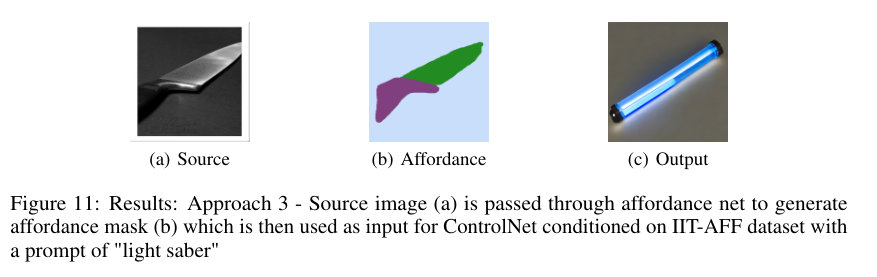

# ControlNet for Affordance based Style Transfer

The goal of image style transfer so far has been to render an image with artistic features guided by a style reference while maintaining the original content. The drawback of neural style transfer algorithms is that they impose a single style uniformly on all parts of the image which makes it difficult to transfer objects from a scene to a thematically different scene. With affordance based style transfer we can preserve the underlying object interactions of the input image and perform a more open style transfer. It allows for more freedom on what an object can be in the target theme because only its affordance needs to be preserved. Imagine a robot that is trained to navigate predominantly in an indoor environment is to be deployed in a new outdoor environment, its perception stack is familiar with indoor objects and cannot generalize to objects in the wild. With an affordance based style transfer, we can morph the new environment to a domain familiar to the robot while ensuring that the functionality of objects in the scene is not changed. This type of style transfer can also find applications in a mixed reality (MR) setting where we can directly change the surrounding of the user instead of creating an environment from the ground up.

### Approach 1 : ControlNet with Affordance aware semantic segmentation

#### Results


### Approach 2 : Blended Diffusion with ControlNet Style Transfer

#### Results


### Approach 3 : End-to-End Affordance Based Style Transfer 

#### Results




### Approach 4 : End-to-End Depth Aware Affordance Based Style Transfer

#### Results


# Usage

First create a new conda environment

    conda env create -f environment.yaml
    conda activate aff_control


Download ControlNet weights for ADE20k and IIT-AFF masks from here: https://drive.google.com/drive/folders/1QeWJuPeEcyJLL3qNXkY7TwLUaO0s5NjG?usp=sharing
Download ControlNet weights for affordance + midas depth masks from here: https://drive.google.com/file/d/1IIMiMtrD--E2mY5g0zspqphOoOeCl64I/view?usp=share_link

Place the weights in the models folder

#### Training
Minimum system requirements:
A10 GPU with 24GB VRAM

To train controlnet on affordance conditioning run:
```
python train_affordance.py
```
To train controlnet on depth + affordance conditioning run:
```
python train_affordance_with_depth.py
```
#### Inference
Minimum system requirements:
K80 GPU with 12GB VRAM should suffice

Launch a gradio app where you can upload your images and run inference:
```
python gradio_aff2image.py
```
Make sure to use the correct weights in gradio_aff2image.py file


# Credits

    @misc{zhang2023adding,
      title={Adding Conditional Control to Text-to-Image Diffusion Models}, 
      author={Lvmin Zhang and Maneesh Agrawala},
      year={2023},
      eprint={2302.05543},
      archivePrefix={arXiv},
      primaryClass={cs.CV}
    }

[Arxiv Link](https://arxiv.org/abs/2302.05543)